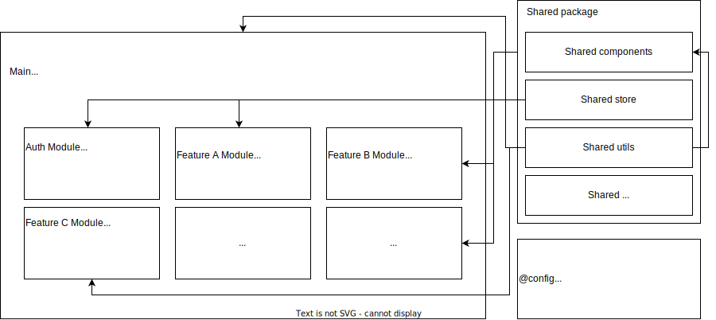

# Federated Modules Monorepo Starter

Starter to bootstrap a web application, composite of React microfrontends and shared components with the help of Module Federation.

## Installation

1. Install Node 16 or later
2. Install pnpm package manager. pnpm is used since it runs faster and solves [NPM doppelgangers problem](https://rushjs.io/pages/advanced/npm_doppelgangers/). For pnpm installation instruction visit [official doc](https://pnpm.io/installation)
3. Run `pnpm install` to install dependencies
4. [Optional, but recommended] Install [husky](https://typicode.github.io/husky/#/) and initialize it (via `npx husky install`) to provide better dev experience (git hooks)

## Usage

### Develop

`pnpm dev` - to start development. This will the whole app up & running. You can also run each sub-app independently by running the command inside them

### Build

`pnpm build` - to compile the whole app.

### Local serve

`pnpm serve:local` - this command simulates real server, so that we receive setup similar if we deploy our dists (all compiled JS/html) on some static hosting (e.g. S3). This command utilizes `build:local` (to provide prod's `dist`, only difference is `remotes` config in webpack). Then, we serve the static files via `serve`.

### Testing

`pnpm test` - to launch Jest + React Testing Library tests for the whole app.

`pnpm e2e` - to launch Playwright E2E tests. They will run against "serve:local" (compiled code, which simulates prod deployment on local machine)

### Linting

`pnpm lint` - to launch ESLint check for the whole app.

### Deploy

`pnpm infra:deploy` - to launch CDK and deploy the app (dist content) to AWS: S3 + CloudFront. Each stage (dev/stage/prod) ideally should have it own dedicated aws account (inside aws organization), so we can deploy the same stack (abd we won't have conflicts because of names).

**NOTE**: prior to deploy any app/package/etc. you have to set up infra. First you need to run `deploy:infra` job (on gitlab), and only once you deployed the infra you can run `deploy:*` for apps/packages. Infrastructure is decoupled from the web app.

For more information on available infra commands visit README in infra folder.

**If you don't need e2e (playwright) - feel free just to delete the corresponding folders, and all references to it in npm script / turbo.json on top level**

## Tech stack

The app in general (and each separate sub-app in particular) are built on top of:

- [Turborepo](https://turbo.build/repo) - for smart & efficient monorepo management
- [pnpm](https://pnpm.io/) - for faster package management and solving [NPM doppelgangers problem](https://rushjs.io/pages/advanced/npm_doppelgangers/).
- [TypeScript](https://www.typescriptlang.org/docs/) (v4+) - 100% support, even for federated modules via dts-loader
- [Webpack](https://webpack.js.org/) (v5+) - with [module federation](https://webpack.js.org/concepts/module-federation/) to be able to ship & deploy apps separately
- [React](https://reactjs.org/) (v18+)
- [React Router](https://reactrouter.com/en/main) (v6+) - NOTE: make sure you do not use Router if it is remote (mfe) app - Router to be present only in host (main) app
- [React Helmet](https://github.com/nfl/react-helmet) (v6+) - to manipulate with document head
- [Zustand](https://github.com/pmndrs/zustand) (v4+) - as lightweight alternative to redux for client-side state management
- [React Query](https://github.com/tanstack/query) (v4+) - for async server-side state management
- [Emotion](https://emotion.sh/docs/introduction) (v11+) - for CSS-in-JS styling approach
- [Material UI](https://mui.com/material-ui/getting-started/overview/) (v5+) - for customizable UI components
- [React Hook Form](https://react-hook-form.com/) (v7+) - for managing forms
- [Zod](https://github.com/colinhacks/zod) - for schema validation
- [Jest](https://jestjs.io/docs/getting-started) (v29+)
- [React Testing Library](https://testing-library.com/docs/react-testing-library/intro) (v13+)
- [Playwright](https://playwright.dev/) - for e2e tests
- [AWS CDK](https://docs.aws.amazon.com/cdk/v2/guide/home.html) (v2) - IaC to deploy the built application(s) on AWS: CloudFront + S3
- [ESLint](https://eslint.org/docs/latest/) + [Prettier](https://prettier.io/docs/en/index.html) + [lint-staged](https://github.com/okonet/lint-staged) + [husky](https://github.com/typicode/husky) - for code quality and better DevExperience
- [PWA](https://web.dev/progressive-web-apps/) experience with the help of [workbox-webpack-plugin](https://github.com/googlechrome/workbox) (v6+) (which provides service worker) and `manifest.json` file - only for main app

## Apps and Packages

- `apps/app1`: Example of some React MFE app
- `apps/app2`: Another example of some React MFE app, which has some shared components with app1
- `apps/main`: Container React app, which places and orchestrates React MFEs (app1 and app2)
- `packages/components`: package with shared components (buttons, fields, etc.), which are used by the apps
- `packages/@config`: package with shared configs for the used tools (ts, eslint, webpack, babel, etc.)
- `e2e`: Standalone application for e2e testing of the whole app. Powered by Playwright
- `infra`: CDK application to provide AWS infrastructure-as-code for the app.

## App composition

1. If a component (util, service, etc.) is shared between 2 or more apps - place it in `shared` components app and reuse. If a component is used only in 1 app (even multiple times, but only 1 app) - place it in `components` folder of the app

## Decision making

Why particularly this tech stack? This is a brief overview/recap why this or that technology has been chosen comparing to the alternatives

1. Turborepo - [lerna](https://lerna.js.org/) was considering as alternative, but it's been decided to choose Turborepo because of its pipelines feature, what makes CI faster and more efficient.
2. pnpm - because of great workplaces and packages management. pnpm really shines in monorepo with multiple interconnected node_modules. It provides similar Dev Experience to [yarn](https://yarnpkg.com/) and npm in classic repos, but in complex monorepos the difference is significant.
3. TypeScript - must-have for modern development. Vanilla JavaScript is hard to maintain in a long run and types system is mandatory even for mid-scale projects.
4. Webpack - for classic front-end apps it is worth considering alternatives, esp. [Vite](https://vitejs.dev/). But for distributed web-app approach webpack ships killer feature - [module federation](https://module-federation.github.io/), which allows to follow [micro-frontends approach](https://micro-frontends.org/). But it is worth to keep an eye on [Vite](https://vitejs.dev/) and [Turbopack](https://turbo.build/pack) to see what they will offer in the future. But at the moment of writing (Jan 2023) - webpack is the tech to go with.
5. React - [Svelte](https://svelte.dev/) and [Solid](https://www.solidjs.com/) seems to be great frameworks and may be true game changers (we will see), but at the moment of writing (Jan 2023) they are still somewhere raw and not ready for production in some aspects. Well, actually not frameworks themselves, but community/eco-system around them. Svelte and Solid need to grow, become more "enterprisey", more established and hope we can come back to them in a year or two. And, probably the most important, it is much easier to find React Developer rather then Svelte/Solid Developer, or JavaScript Developer mature enough to be able to code in Svelte/Solid quickly. Being said, it is easier to find a decent React dev for a project, and very likely more cost-efficient (since there are much more React devs on market).
6. React-Router - de-facto standard for routing in React eco-system. There is no real competitor. React-router just does it must do.
7. React-Helmet - similar to react-router library - it just does its work.
8. Zustand - brilliant state management library which implement well-known flux (single-direction) principles. It's big brother - [Redux](https://redux.js.org/) - seems to be too clunky and complicated, especially when you have seen Zustand's simpleness. Why complicate life, if it can be easy? The same comes to mind when comparing zustand vs. redux - why complicate things, if they can be simple. If you still have to use Redux, it's worth considering [Redux Toolkit](https://redux-toolkit.js.org/), which makes classic Redux simpler and remove some boilerplate code. But still - it is still not that level of simpleness which zustand provides. Client-side global state management should be as simple as possible. Most of the cases can be covered by tools provided by React itself out of the box (e.g. useState, useReducer, or Context), or by server-side state management tools (about which is the next item).
9. React Query (Tanstack Query) - simplifies communication with server a lot. It just solves lots of problems, which you usually solve from project to project: when to cache api calls, when invalidate cache, when update it, requests retry, etc. Redux is often used to handle server-side state as well, but this is what blows it up. Zustand - for client-side state, react-query - for server-side. Though if you still go with Redux - it is highly recommended to go with [RTK Query](https://redux-toolkit.js.org/rtk-query/overview), which is redux-toolkit alternative to react-query.
10. Emotion.js - fast, performant, encapsulated CSS-in-JS. Lots of UI components libraries use it under the hood (e.g. Material UI 5+), what proves its efficiency. Also it already comes with autoprefixer and other stuff to ensure compatibility with all browsers. CSS Modules solve only 1 problem - encapsulation, you still need to have autoprefixer, etc. Styled-components are slower and more bulky.
11. Material UI - version 5 solves lots of issue version 4 has. It is now faster, smaller, better, and uses latest React features. And comes with lots of components ready. One of cons is that it is opinionated to Material Design, but it is still can be customized pretty nicely with `styled` helper (only do not overwrite styles directly in css!, and use theming). Worth keep an eye on [MUI Base](https://mui.com/base/getting-started/overview/) - library of "un-styled", "headless" MUI components. It is in alpha at the moment of writing, but in the future it will be most likely a way to go with UI components. I would consider other alternatives: [Ant Design](https://ant.design/), [Chakra UI](https://chakra-ui.com/), [React Bootstrap](https://react-bootstrap.github.io/) ONLY if they very close to your actual design. Otherwise it is easier to grab MUI and customize/theme it properly (if you want - you can completely remove actually Material Design from MUI and leave only logic - this is basically what MUI Base already trying to do)
12. React Hook Form - form handling done in easy way. There is [Formik](https://formik.org/), which was a way to go for quite a time, but RHF is just better and more light-weight - less code, more capabilities (it is not straight-forward to access formik props outside of the form itself, etc.)
13. Zod - next-generation [Yup](https://github.com/jquense/yup). Mainly thanks to great TS support. Roughly, it is just evolution of yup.
14. Jest - there is just no real alternative in front-end JS unit testing. [Mocha](https://mochajs.org/) may be an alternative on large back-end projects, but still, Jest is de-facto standard.
15. React Testing Library - there is [enzyme](https://github.com/enzymejs/enzyme/), but it does testing in the old way, where you check props, attributes, etc. It is more unit-testing scale, and there is not real reason to do it for React components. RTL takes alternative, and I'd say better, approach - it examines component's behavior and appearance, and shifts testing more towards integration layer.
16. ESLint + Prettier + lint-staged + husky - there are TSLint, ESHint and others - but only this gang of 4 made it through years and haven't been deprecated (because they, again, just do their job)
17. Playwright - at initial look [Cypress](https://www.cypress.io/) seemed to be a tool to go with - it is battle-tested, mature and have big community. But still we should inspect alternatives just in case, and here we come by Playwright, which seems to take all good parts of cypress, and add broader browsers support (e.g. Safari), is TS-first, plus supports multiple languages (just in case), and (in my personal opinion) is even easier than cypress.
18. AWS CDK - [Disclaimer: this is very opinionated section] the most advanced IaC solution for AWS. The main alternative - [Terraform](https://developer.hashicorp.com/terraform/docs) - has some advantages over CDK: it is cloud-agnostic and therefore is definitely a way to go if you want to do multi-cloud and just want to avoid vendor-lock. But, in our case, we completely commit to AWS and realize it. We are planning to deal with AWS only, and taking this constraint into account, CDK seems a better fit - it allows doing IaC in first-class programming language (in our case - TypeScript), while Terraform incorporates its own syntax - HCL, which is less flexible, and actually more competes with CloudFormation, rather than with CDK. TFCDK - CDK from Terraform world - is still not production-ready, though it actually can be considered as alternative in future. CDK just fills more natural to developers, where CDK app is actually kinda TS app. It is very subjective choice and there is no really a right answer, and a discussion between CDK vs Terraform and other tools (Pulumi, etc.) can take a lot of time and letters to type, so we just commit to CDK and build IaC with it.

**Note on Storybook**: as project grows and becomes bigger, there will be need to document, demo and test its design system. It's worth take a look at [Storybook](https://storybook.js.org/) as a tool for this - it is quite a complex tool, have lots of addons and can be personalized per project's needs. It is not include in the starter, though may make sense for the project at bigger scale. It can be easily added as standalone app, which imports other components (from shared, etc.) and demos them.
